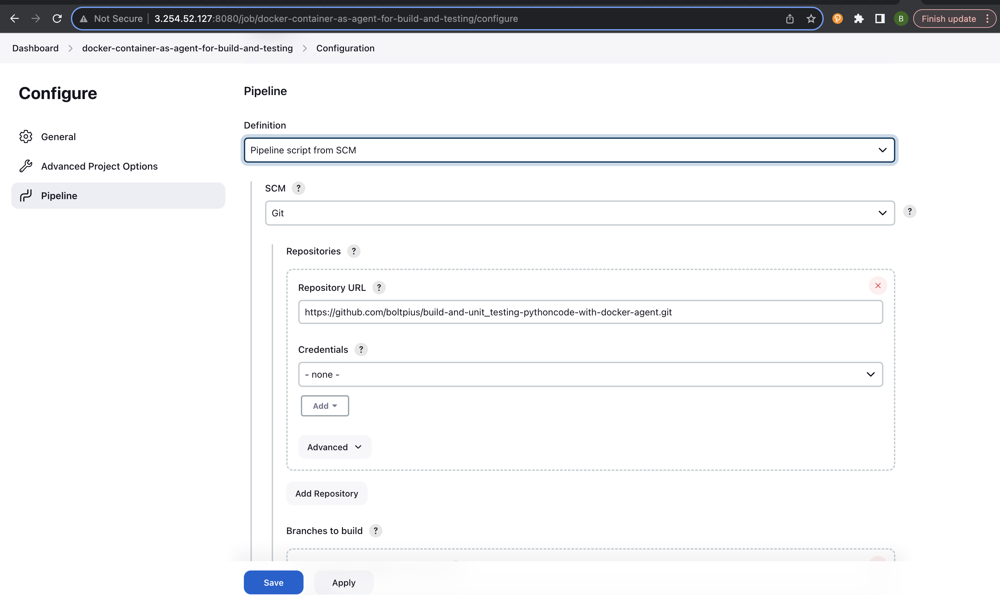
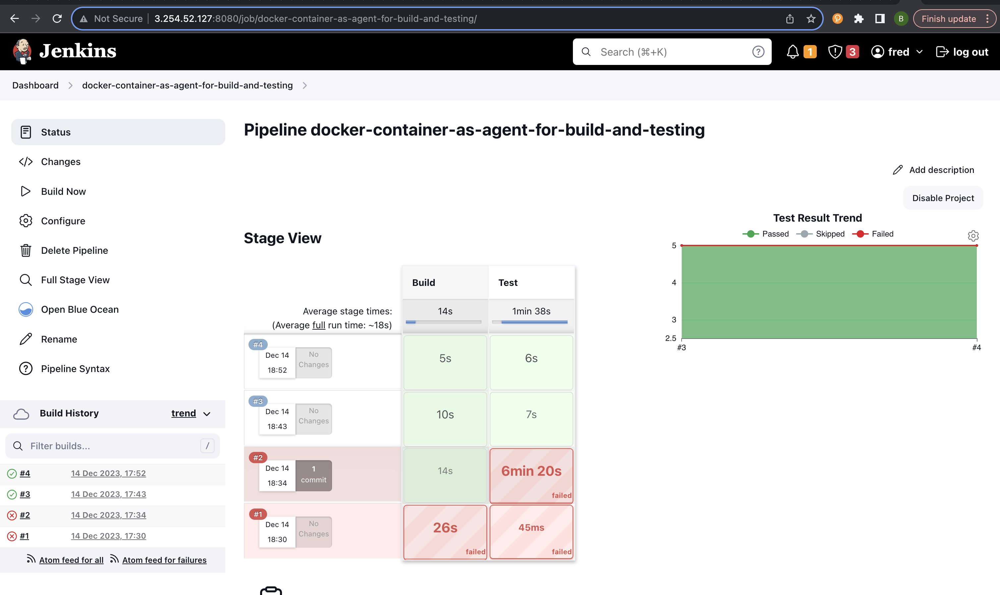

# Using Docker Containers as Jenkins Agents for Build and Test Pipeline

## Project Overview
This project aimed to establish a continuous integration pipeline using Jenkins and Docker containers as agents for building and testing Python code. The primary focus was on maintaining consistency across diverse environments and preventing conflicts by isolating the build and test processes within Docker containers.

### Pipeline Structure

#### Build Stage
- **Objective**: Compiled Python scripts (`add2vals.py`, `calc.py`) utilizing the `python:2-alpine` Docker image.
- **Steps**:
  - Performed Python file compilation.
  - Stashed compiled results for later use.
  - Listed files in the workspace for validation.

#### Test Stage
- **Objective**: Ran tests employing the `qnib/pytest` Docker image.
- **Steps**:
  - Executed pytest with XML report generation.
  - Displayed test results within the Jenkins interface.
  
### Key Script Functionalities

#### `add2vals.py`
- **Purpose**: A command-line tool to add two values utilizing the `calc.py` library.
- **Functionality**:
  - Accepted input values and performed addition using the `add2` function.
  - Provided usage guidelines and handled various input scenarios.

#### `calc.py`
- **Purpose**: Contained the `add2` function responsible for adding two values.
- **Functionality**:
  - Converted values to appropriate types (int, float, or string) for addition.
  - Ensured concatenated string output for string inputs.

#### `test_calc.py`
- **Purpose**: Hosted unit tests for functions within the `calc` library.
- **Test Cases**:
  - Verified addition of integers, floats, and strings.
  - Checked concatenation of strings with integers and floats.

### SCM Integration Process

1. **Repository Configuration**:
   - Configured Jenkins to fetch the Pipeline script from my github repository.
   - Ensured accurate repository URL in Jenkins.

2. **Jenkins Job Setup**:
   - Defined the branch containing the Jenkinsfile for pipeline execution.

3. **Execution and Outputs**:
   - Triggered Jenkins job execution to run the pipeline fetched from SCM.
   - Monitored job output for successful retrieval and execution

### Project Outcomes
- Successfully compiled results stashed for further use.
- Test reports generated in XML format and displayed within the Jenkins interface.

